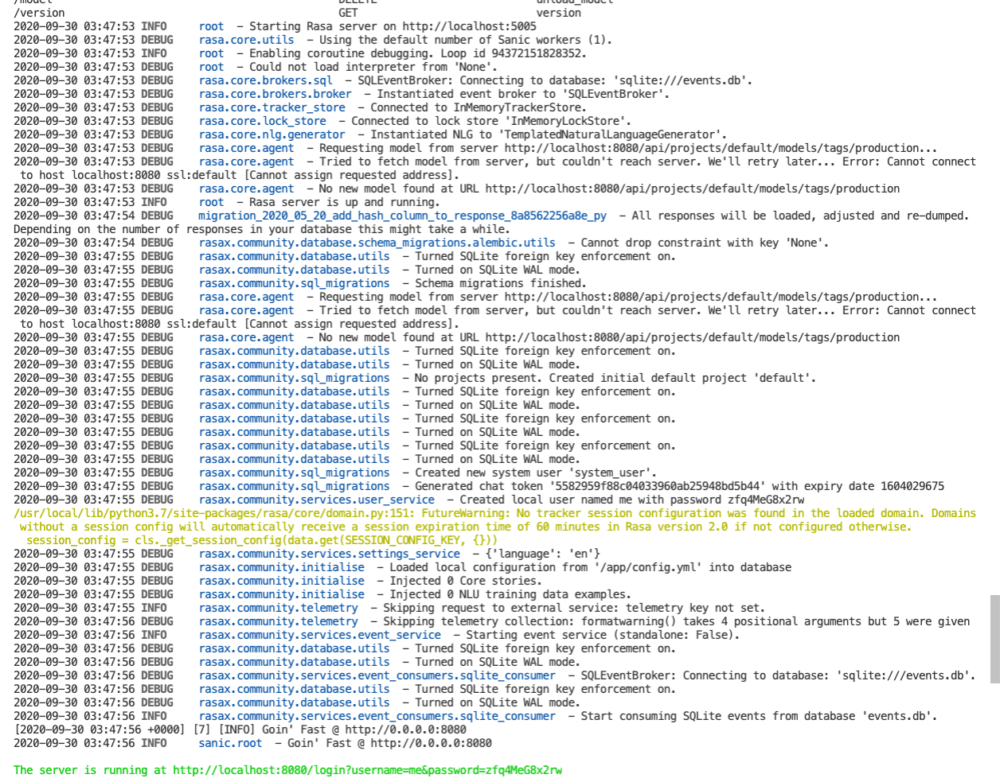

# Rasa X Production Flag Bug Demo

This repo demonstrates the bug that 

This repo demonstrates the 🐛 behaviour when using the `--production` flag with the enterprise rasa x docker image `gcr.io/rasa-platform/rasa-x-ee:latest`.

Currently when the `--production` flag is used the startup process halts on "Rasa server is up and running.". See below:


Without using the `--production` flag we don't see this behaviour and instead the rasa x instance spins up as expected: See below:




## Impact to Enterprise Customers

> From the investigation I've currently conducted I can curently see no work around to this issue.

For us (nib) as an enterprise customer this 🐛 is a blocker as we require the usage of the Postgres event broker however when trying to use the Postgres event broker without the `--production` flag we get the following error:

```
Rasa X currently only supports a SQLite event broker with path 'events.db' when running locally. You can deploy Rasa X with Docker (https://rasa.com/docs/rasa-x/installation-and-setup/docker-compose-quick-install/) if you want to use other event broker configurations.
```

It's also worth mentioning that at the time of writing this the above support link is also broken `https://rasa.com/docs/rasa-x/installation-and-setup/docker-compose-quick-install/`.


## How to Reproduce

### No Production Flag

First let's see what the normal behaviour looks like I.e without the production flag.

```bash
# First cd into the folder
cd ./noProductionFlag

# Build the docker image, note you will need to correctly docker login to gcr in order to pull the enterprise image
docker build --no-cache --rm -t chatbot-rasa-x-no-production-flag .

# Run the image
docker run --rm -it  -p 8080:8080/tcp chatbot-rasa-x-no-production-flag:latest

# Observer the log "The server is running at http://localhost:8080/login?username=me&password=xyz"

# Navigate to http://localhost:8080/login
```

Now ensure the docker container is stopped.


### Production Flag

Ok now let's see the incorrect behaviour.

```bash
# First cd into the folder
cd ../productionFlag

# Build the docker image, note you will need to correctly docker login to gcr in order to pull the enterprise image
docker build --no-cache --rm -t chatbot-rasa-x-production-flag .

# Run the image
docker run --rm -it  -p 8080:8080/tcp chatbot-rasa-x-production-flag:latest

# Observer that the startup process is unable to get pass the "Rasa server is up and running" log.
```
